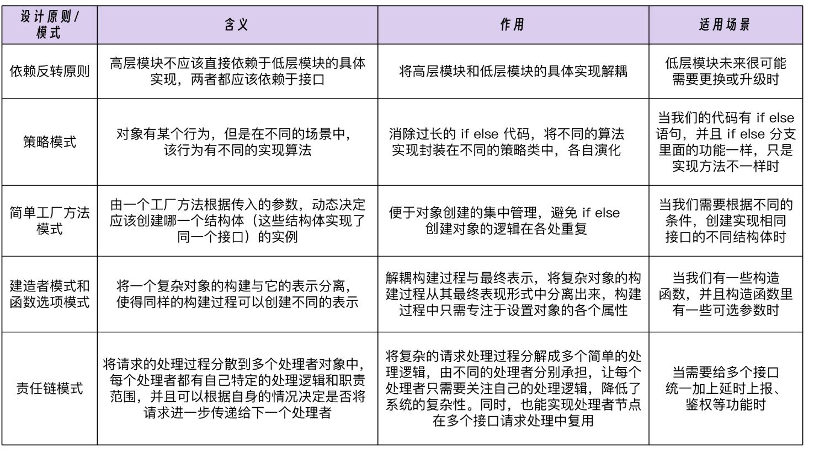

* 使用依赖反转原则，比如一个server接口, 调用redis和mysql的访问，
* 这个时候，如果想要测试该server的一个接口，一般是Mocker redis的访问和mysql的访问，
* 实际操作是：改 dal 目录里的代码，写死方法的返回值用于测试，要么往测试环境 Redis 和 MySQL 里造数据。

* 使用设计模式来规避这样的修改：
* 使用Golang 接口和依赖反转原则来实现 mock 外部依赖的能力.
* 比如： service 层的 ProductionServerImpl 依赖于dal 接口(属于依赖反转).

* 如何动态的选择缓存和db的访问。
* 
