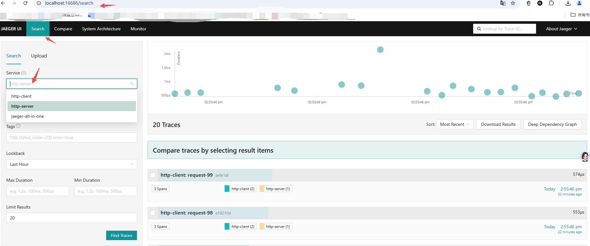

* 把 http client/server 两个进程内添加的 trace 信息 送到 jaeger 追踪链系统，并展示结果 的流程，当前演示使用的 jaeger 单机一体化版。
* 1）单机安装 jaeger 版本： git clone git@github.com/jaegertracing/jaeger.git 最新版本，进入源码根目录，运行 git submodule update --init --recursive 获取子项目；  make  run-all-in-one 运行整个一体化版本（包括 后端服务，前端页面，数据的底层cache存储）
* 2）编译http client/server 二进制源码， 运行如下命令：

  go build -o http-client ./http-tracer-demo/client/main.go

  go build -o http-server ./http-tracer-demo/server/main.go

分别得到 http-client, http-server 二进制文件。
* 3） 设置运行环境变量，支持上面 http 服务连接 jaeger的配置。
  
   export OTEL_EXPORTER_OTLP_ENDPOINT=http://0.0.0.0:4318 主要是  jaeger接收数据端口 4318 

* 4） 安许分别运行 http-server, http-client.
* 5 ) 在页面上查看jaeger 的tracer 效果，登陆：http://localhost:16686/ 
* 6） jaeger ui 界面图：
* 
  
* 
  
* 