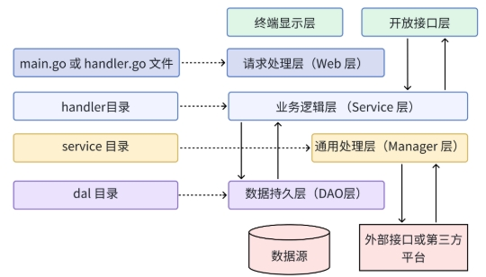

*  control 层/表现层:     main.go / handler.go => 封装路由，接收前端请求，参数校验和路由,调用 service 层
*  service 层/业务逻辑层:  handler 目录, 主要负责业务逻辑处理, 调用 DAO 层和 通用处理层. 比如 order_handler.go production_handler.go 文件. 调用dal(dao)层，不直接读写数据库
*  通用处理层:             service 目录, 将上层Service层(handler 目录)的通用业务逻辑下沉到这一层. 封装第三方接口调用, 外部接口.
*  dal 层:               dal 目录, 负责 实际具体数据结构 MySQL、Redis 等数据库的增删改查; can 新建不同的子目录
*  model 层: 存放层与层之间的数据传输结构体定义和数据库表实体定义
* 
* 
* 上面是传统后端 mvc 架构的分层模式。